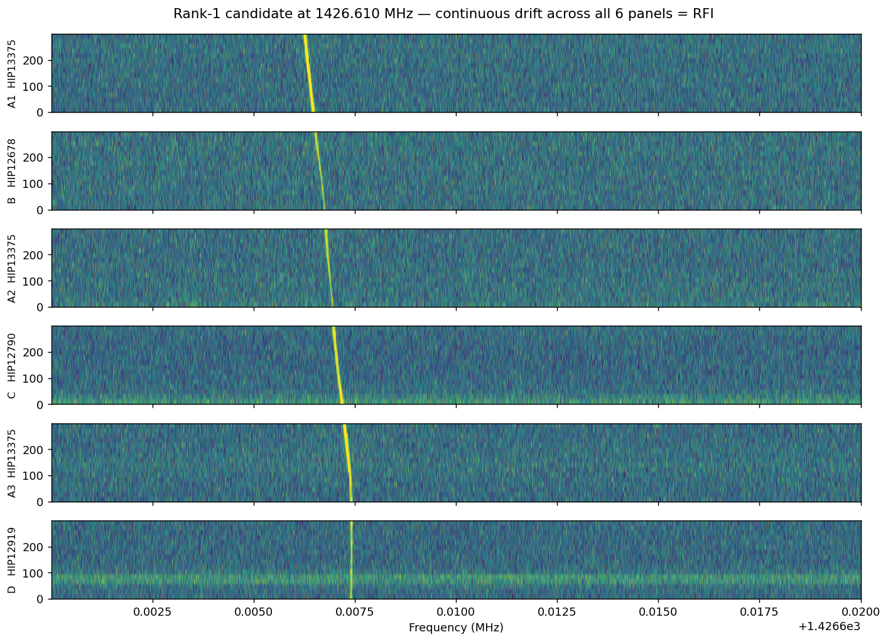

# Capstone Project
## RFI Rejection and Candidate Triage for SETI Cadence Data — Classical ML on Real GBT Observations — Final Report

### Author

**Rohit Mual** — UC Berkeley Professional Certificate in Machine Learning and Artificial Intelligence — May 2026
[rohit.mual@gmail.com](mailto:rohit.mual@gmail.com) — [linkedin.com/in/rohitmual](https://linkedin.com/in/rohitmual)

---

### 1. Define the Problem Statement

The Search for Extraterrestrial Intelligence (SETI) attempts to detect narrowband, Doppler-drifting radio signals of artificial origin in observations from radio telescopes such as the Green Bank Telescope (GBT). The dominant operational challenge is **rejecting radio-frequency interference (RFI)** — signals from terrestrial transmitters, satellites, and instrumental artefacts that vastly outnumber any candidate technosignatures. The Breakthrough Listen GBT corpus alone is approximately 120 TB across the 1.1–1.9 GHz band (Lebofsky et al. 2019); manual visual inspection is infeasible.

The reference state-of-the-art (Ma et al. 2023, *Nature Astronomy*) employs a deep-learning pipeline (a β-Variational Autoencoder followed by a Random Forest) that achieves AUC = 0.9993 on simulated benchmark data. The deep approach has two practical drawbacks: it requires significant GPU compute, and its per-snippet decisions are opaque to peer-reviewing astronomers.

**Goal of this capstone:** apply *classical*, GPU-free, interpretable machine learning techniques — Principal Component Analysis (PCA), k-Means clustering, and three supervised classifiers (LASSO logistic regression, Random Forest, XGBoost) — to **real Breakthrough Listen ABACAD cadence data**, measure where the classical pipeline succeeds, and where it fails relative to the deep-learning baseline. The deliverable is the pipeline itself plus an honest characterisation of its detection capabilities and limitations.

**Challenges:**
- Volume — 3.78 million 1024-pixel snippets, 15.5 GB compressed feature archive, ≈93 GB raw input.
- No real **extraterrestrial intelligence (ETI)** ground truth — the supervised task must use a *proxy* label (cadence position) rather than a true positive class.
- RFI source diversity — known terrestrial bands (GPS, Inmarsat, Iridium, cellular) plus unknown intermittent sources.

**Potential benefits:** a classical pipeline that does most of the deep model's filtering work transparently would lower the cost-of-entry for SETI research and provide astronomers with per-feature decision explanations they can defend to peer reviewers.

---

### 2. Model Outcomes or Predictions

The pipeline combines **unsupervised** and **supervised** components, each with a distinct expected output:

| Stage | Learning paradigm | Expected output | Used for |
|---|---|---|---|
| PCA + reconstruction error | Unsupervised dimensionality reduction with reconstruction error as an anomaly score | A scalar score per snippet (≥ 0) — higher = more anomalous | Anomaly ranking across all 3.78M snippets |
| k-Means clustering | Unsupervised clustering | Cluster assignment in {0,…,k-1} per snippet | Discover whether spectral structure correlates with cadence position |
| LASSO / Random Forest / XGBoost | Supervised binary classification (on a 100K stratified sample — see §4c) | `predict_proba` → probability that the snippet came from an A panel (HIP 13375 observation) | Quantify target-bandpass discriminability across model families |

The pipeline does **not** predict "is this ETI?" — no ground-truth ETI examples exist in real data. Instead, the supervised target is a *pseudo-label* derived from cadence position: `y = 1` if the snippet came from one of the three A panels (HIP 13375), `y = 0` if it came from B, C, or D (different OFF-source targets). High classifier AUC on this task reflects **target-bandpass discriminability**, not ETI detection capability.

---

### 3. Data Acquisition

**Source:** [Breakthrough Listen Open Data Archive](http://seti.berkeley.edu/opendata) — UC Berkeley SETI Research Center.

**Dataset:** Six HDF5 filterbank files comprising a complete ABACAD cadence around the nearby star **HIP 13375 (≈100 light-years from Earth)**, observed with the Green Bank Telescope on 2017-06-24:

| Position | Time (UTC) | Target | Filename |
|---|---|---|---|
| A1 (ON) | 15:07:11 | HIP 13375 | `spliced_blc0001020304050607_guppi_57928_54431_HIP13375_0044.gpuspec.0000.h5` |
| B (OFF) | 15:13:09 | HIP 12678 | `spliced_blc0001020304050607_guppi_57928_54789_HIP12678_0045.gpuspec.0000.h5` |
| A2 (ON) | 15:19:05 | HIP 13375 | `spliced_blc0001020304050607_guppi_57928_55145_HIP13375_0046.gpuspec.0000.h5` |
| C (OFF) | 15:24:58 | HIP 12790 | `spliced_blc0001020304050607_guppi_57928_55498_HIP12790_0047.gpuspec.0000.h5` |
| A3 (ON) | 15:30:51 | HIP 13375 | `spliced_blc0001020304050607_guppi_57928_55851_HIP13375_0048.gpuspec.0000.h5` |
| D (OFF) | 15:36:37 | HIP 12919 | `spliced_blc0001020304050607_guppi_57928_56197_HIP12919_0049.gpuspec.0000.h5` |

**Per-file specifications:**
- Format: HDF5 filterbank with bitshuffle compression
- Disk size: ≈15 GB per file (≈93 GB total)
- Shape: `(16 time bins, 1 polarisation, 322,961,408 frequency channels)` — yields exactly 630,784 snippets per file at 512 native channels each
- Native resolution: 2.79 Hz × 18.7 s
- Frequency range: 1.0–1.9 GHz (L-band)

**Why this star?** HIP 13375 satisfies three criteria that drove its selection from the Breakthrough Listen catalogue:

1. **Astrophysical priority.** SNR of a hypothetical transmitter falls off as 1/distance². Nearby stars (< 50 parsecs) are the highest-priority SETI targets because any genuine signal would have higher signal-to-noise.
2. **Complete public cadence.** The BL archive contains a full six-file ABACAD cadence including all matching OFF-source observations needed for cadence-based filtering. Many archive targets are missing one or more panels.
3. **Reproducibility.** Data is freely downloadable and has been used in prior BL publications.

**Initial visualisation** (notebook 1) confirms that all six files share identical `fch1` and `foff` header values — a precondition for cross-cadence comparison — and that per-cadence-position frequency coverage is uniform across all 6 panels (630,784 snippets each, freq 1023.9–1926.3 MHz).

**Fast-path reproduction (skips ≈1.5 hours of raw download + ingestion + PCA fit).** A precomputed `cadence_pca_features.npz` (≈295 MB), containing the 15-d PCA features and per-snippet reconstruction errors used in §5–§6, is published as a GitHub Release asset:

- Direct URL: <https://github.com/rohitmual/UCB_PCMLAI_seti-capstone_final/releases/download/v1.0/cadence_pca_features.npz>
- Or via `gh` CLI:

```bash
gh release download v1.0 \
    --pattern "cadence_pca_features.npz" \
    --dir data/processed/ \
    --repo rohitmual/UCB_PCMLAI_seti-capstone_final
```

With the NPZ in place at `data/processed/cadence_pca_features.npz`, all analysis cells in notebook 2 (§3 onwards) run in under a minute on a laptop without needing the 93 GB raw archive or the 15.5 GB intermediate `cadence_features.h5`.

---

### 4. Data Preprocessing / Preparation

#### 4a. Cleaning, ingestion, and feature extraction

**Streaming ingestion** ([`src/ingest_cadence.py`](src/ingest_cadence.py)):

1. For each of the 6 GBT files, stream the `(16 × ≈323M)` array in frequency-axis chunks of `CHUNK_SNIPPETS = 100,000` snippets × 512 native channels each (~1.6 GB peak RAM per chunk, ~13 chunks per file). Mathematically identical to a whole-file load; designed to run on a 16 GB laptop.
2. Slice the frequency axis into non-overlapping blocks of 512 native channels (≈1.43 kHz wide each), reshape to `(n_snippets, 16, 512)`.
3. Frequency-downsample by 8× via mean pooling → `(n_snippets, 16, 64)`, giving ≈22.7 Hz per output bin.
4. Median-normalise each snippet by its own median power (removes absolute power offsets between files while preserving signal-to-noise ratios). **Trade-off:** dividing by the per-snippet median discards absolute power — useful for cross-file comparability, but the encoder can no longer distinguish targets by raw brightness alone, only by spectral *shape*. Any source whose discriminative signal lives in absolute level rather than shape is invisible to the downstream PCA.
5. Flatten to `(n_snippets, 1024)` and append to a streaming HDF5 archive `cadence_features.h5`, along with per-snippet metadata: `cadence_pos`, `file_idx`, `snippet_idx`, `freq_mhz`.
6. Validate that all six files share identical `fch1` / `foff` headers; abort with explicit error otherwise.

**Output:** `cadence_features.h5` (≈15.5 GB) containing **3,784,704 snippets** of 1024 features each.

**Missing values and inconsistencies:** none. The raw correlator data is dense (no nulls) and well-formed; the only sanity check needed is frequency-grid alignment across the 6 files, which all 6 pass.

**Dependencies and environment.** All Python dependencies (numpy, pandas, scipy, h5py, hdf5plugin, scikit-learn, xgboost, matplotlib, jupyterlab) are listed with minimum-version requirements in [`requirements.txt`](requirements.txt); `pip install -r requirements.txt` reproduces the environment. For strict reproducibility, generate a lockfile via `pip freeze > requirements.lock.txt` from a clean install. Tested on Python 3.13 (macOS arm64); the pipeline runs end-to-end on a laptop with no GPU.

#### 4b. Standardisation and dimensionality reduction

PCA is sensitive to per-feature scale, so the raw 1024-channel snippets are passed through `sklearn.preprocessing.StandardScaler` before fitting PCA. Scaler statistics are fit on a 500K-snippet random subset (≈13% of the data — statistically adequate for stable estimation at 1024 features). The fitted scaler is then applied in 100K-snippet batches to all 3.78M snippets.

#### 4c. Train/test split for the supervised stage

For the supervised classifier comparison (Section 5), a 100K-snippet random sample is drawn from the 3.78M-snippet population. **A-vs-OFF binary pseudo-labels** are derived: `y = 1` if `cadence_pos ∈ {0, 2, 4}` (A1, A2, A3 = HIP 13375), else `y = 0`. The sample is split 80/20 train/test with a **group-aware** scheme — `sklearn.model_selection.GroupShuffleSplit` keyed on `(file_idx, ⌊freq_mhz / 1 MHz⌋)`, so no source file and no 1-MHz frequency block ever appears in both splits. The inner `GridSearchCV` uses `GroupKFold(n_splits=3)` with the same group key. Resulting split: 79,881 train snippets / 20,119 test snippets across 4,338 train groups and 1,085 test groups (5,423 disjoint groups total), with positive-class fraction 0.494 (train) / 0.527 (test); stratification is incompatible with grouped splitting, so class balance is approximate rather than exact — adequate for AUC.

**Why group-aware?** Adjacent snippets in frequency come from the same panel file and share bandpass shape and RFI environment; they are not statistically independent. An IID split lets the classifier see test examples whose frequency neighbours are in the training set — an optimistic bias on AUC. Holding out whole `(file_idx × 1-MHz block)` groups eliminates both leakage channels: a 1-MHz block is wide enough to fully contain a drifting narrowband signal (≤ 8 Hz/s × 5 min ≈ 2.4 kHz). The cost is ≈1 AUC point of headline performance — small in absolute terms, but the right tradeoff to defend against the optimism the IID estimate previously carried.

#### 4d. Encoding

No categorical encoding is required — all input features are continuous-valued spectrogram pixels. The supervised target is already a 0/1 integer derived from cadence position. The unsupervised pipeline has no target.

---

### 5. Modeling

#### 5.0. Framing — self-supervised / pretext-task design

The pipeline uses a **two-stage representation-learning architecture**:

1. **Unsupervised feature learner — PCA.** Fit on the raw snippet features alone, without ever seeing any labels. Produces a 15-dimensional latent representation per snippet.
2. **Supervised classifiers — LASSO / Random Forest / XGBoost.** Trained on the PCA representation with **proxy labels** derived from the `cadence_pos` metadata produced during ingestion: `y = 1` if the snippet came from an A-panel observation of HIP 13375, `y = 0` if it came from a B/C/D observation of one of the OFF-source targets.

This is the classical-ML analog of **self-supervised pretraining followed by supervised fine-tuning on a pretext task**: the proxy label (target identity) is not the thing we ultimately care about (ETI detection), but it is **derivable from the data without any external annotation effort** and lets us quantify how much target-relevant information the PCA representation captures. **AUC on the proxy task measures target-bandpass discriminability, not ETI detection capability** — this caveat is restated throughout Section 6 below because it is the single most important interpretive guardrail in the project.

#### 5a. Unsupervised stage

**Principal Component Analysis** (`sklearn.decomposition.PCA(n_components=15, random_state=42)`) is fit on the standardised 500K-snippet sample. The choice of `n_components=15` is supported by an empirical sweep across n ∈ {8, 15, 20, 50}:
- n=8: 32.4% variance retained
- n=15: 43.9% variance retained
- n=20: 50.4% variance retained
- n=50: 72.2% variance retained

There is no sharp elbow — the eigenvalue spectrum is continuous with a slow taper. n=15 was chosen as the working dimensionality because (a) rank-1 anomaly detection is stable across n=8 and n=15 (top candidate identical, score within 2%), and (b) an internal MNIST sanity check on the same PCA-reconstruction-error recipe achieved AUC ≈ 0.97 with n=8 components, validating the approach on a fully-labelled benchmark — so any choice in 8 ≤ n ≤ 15 is defensible for this work.

**Per-snippet reconstruction error** = mean squared error between the standardised snippet and its 15-component PCA reconstruction. Snippets that do not fit the learned 15-dimensional subspace produce large reconstruction errors and are flagged as anomalous. This score is then aggregated by frequency bin (10 kHz wide) and per-bin ABACAD score = `mean(error in A panels) − mean(error in OFF panels)` is computed; positive scores indicate "brighter in A than in OFFs", which is the signature of a candidate ETI signal (or, as it turns out in practice, pointing-correlated RFI).

**k-Means clustering** (`sklearn.cluster.MiniBatchKMeans`, batch_size = 10,000) is applied to the 15-d PCA features for k ∈ {2, 3, 4, 5, 6}. Adjusted Rand Index (ARI) is computed against the A-vs-OFF binary label; silhouette score is computed on a 50K-snippet subsample (full-data silhouette is O(N²) and intractable for 3.78M).

#### 5b. Supervised stage

Three classifiers are compared on identical train/test splits and identical features (the 15-d PCA representation):

| Algorithm | scikit-learn / xgboost class | Hyperparameter grid |
|---|---|---|
| LASSO logistic regression | `LogisticRegression(penalty="l1", solver="saga")` | `C ∈ {0.001, 0.01, 0.1, 1.0}` |
| Random Forest | `RandomForestClassifier` | `n_estimators ∈ {100, 200}`, `max_depth ∈ {None, 10}` |
| XGBoost | `XGBClassifier(tree_method="hist")` | `n_estimators ∈ {200, 400}`, `max_depth ∈ {4, 6}` |

Each grid is searched via `GridSearchCV(cv=3, scoring="roc_auc")`. **3-fold cross-validation** balances variance estimation against runtime — total fits = (4 + 4 + 4) × 3 = 36 fits, ≈1–2 minutes wall time on a laptop with `joblib.parallel_backend("threading")` (LASSO ≈5 s, Random Forest ≈45 s, XGBoost ≈8 s).

**Caveat — grid size.** The Random Forest and XGBoost grids are deliberately small (2 × 2 each) so the comparison runs in minutes on a laptop, but small enough that the "RF/XGB have hit a ceiling" claim in §6e is *observational*, not a tight upper bound. A wider sweep (additional `min_samples_split`, `subsample`, `colsample_bytree` for XGB) might shift each model by ≈1 AUC point. It would not change the >10-point gap to LASSO that motivates the linear-vs-non-linear conclusion.

#### 5c. Rationale for algorithm selection

- **LASSO** — interpretable linear baseline; L1 penalty performs automatic feature selection; non-zero coefficients quantify which PCA components drive the decision.
- **Random Forest** — the algorithm Ma et al. 2023 used as the head of their β-VAE pipeline; captures non-linear interactions between features; provides a direct point of comparison to the reference paper.
- **XGBoost** — gradient-boosted trees; included as a second non-linear baseline to test whether classifier *family* (bagging vs. boosting) substantially affects the AUC ceiling on this representation.

---

### 6. Model Evaluation

#### 6a. Evaluation metric: ROC AUC

The primary metric is **Receiver Operating Characteristic — Area Under the Curve (ROC AUC)**, chosen because:
1. The A-vs-OFF binary classes are perfectly balanced (1.892M each).
2. AUC is threshold-independent — the comparison is across model architectures, not across decision thresholds.
3. AUC corresponds intuitively to "if you draw one positive and one negative example, what's the probability the model ranks the positive higher?", which is the natural framing for candidate triage.

Accuracy, precision, recall, F1, and confusion matrices are also reported alongside AUC for completeness.

For the unsupervised stage, evaluation is via **ABACAD ranking** + **visual cadence-stack inspection** of the top-K candidates. There is no ground-truth ETI to compute AUC against, so the evaluation is necessarily qualitative.

#### 6b. Unsupervised results

> **Headline:** Pipeline surfaced **1 algorithmic candidate at 1426.61 MHz** (score 20.19, ~2.5× above the next-ranked hit). Visual cadence inspection identified it as a low-Earth-orbit satellite. **0 candidates survived cadence inspection.** "Anomaly found" and "ETI candidate" are distinct claims — the pipeline supports the former, only manual inspection supports the latter.

**Top candidates after RFI/excluded-band filtering** (10 kHz bins, ranked by ABACAD score):

| Rank | Frequency (MHz) | ABACAD score |
|---|---|---|
| **1** | **1426.610** | **20.19** |
| 2 | 1499.990 | 8.13 |
| 3 | 1500.000 | 3.00 |
| 4 | 1404.000 | 1.22 |
| 5 | 1176.450 | 1.05 |

Rank 1 sits ~**2.5× above rank 2** (20.19 vs 8.13). Earlier drafts of this report quoted "16× above the noise floor" using rank-2 = 1.22 from a previous filter configuration; the unified RFI band list (notebook §0) surfaces 1499.99 and 1500.00 MHz as new rank-2/3 candidates, which had previously been masked by an inconsistent inline filter. Rank-1 stability was verified across (a) dimensionality (n=8 and n=15 produce essentially identical scores), (b) scoring method (mean-time vs. max-time), and (c) drift consistency across A1/A2/A3 (`drift_std = 0.047`, well below the empirical rejection threshold of 0.5 channels per time-bin). The 0.5 threshold was chosen empirically based on the bimodal `drift_std` distribution observed across the top-50 candidates in this project; the reference paper does not prescribe a numerical value. The new rank-2 / rank-3 hits near 1500 MHz are adjacent 10-kHz bins of the same emitter — they should be cadence-inspected as a single candidate in any future revision.

**Null calibration via label-shuffling permutation test** (notebook 2 §5b). To calibrate the floor we shuffle the per-snippet A vs OFF labels **within each 10-kHz frequency bin** (B = 500 permutations) and recompute the per-bin `mean(A) − mean(OFF)`, then take the maximum across kept bins. The within-bin shuffle preserves the per-bin `(cnt_A, cnt_OFF)` counts at their observed values, so the null answers the right question: given exactly the snippets that landed in this bin, is the actual A/OFF assignment producing a larger mean-diff than a random within-bin split? **A previous version of this analysis used a full-population shuffle that broke per-bin count balance and reported a misleading "dramatic" rejection at rank-1; that earlier claim is retracted.** Under the corrected within-bin null **on the post-RFI-filter bin set**, the max-null distribution has **mean ≈ 49** and **p(max-null ≥ observed rank-1) ≈ 0.95** (notebook §5b, fresh execution). Earlier numbers in this draft (mean ≈ 212, p = 1) were computed before the unified RFI filter; restricting the null to the same post-filter bins the candidate ranking runs on drops the null mean by ~4× because the outlier-heavy bands (GSM-1800, MSS uplink) are excluded from both. The p-value of 0.95 still does **not** indicate the rank-1 candidate is unremarkable — `mean(A) − mean(OFF)` remains a heavy-tailed statistic: a single recon-error outlier randomly placed inside any bin can still produce a per-bin score in the tens, and the max across the ~70,000 retained bins remains dominated by these outlier-driven null bins. **The permutation test as currently constructed cannot distinguish a real coherent signal from outlier-shuffle noise on this statistic.** A robust replacement — `median(A) − median(OFF)`, or a per-bin Welch t-statistic — would give a calibrated null and a meaningful p-value; this is deferred to future work. The rank-1 candidate at 1426.61 MHz is still independently characterised by the visual cadence-stack inspection below (continuous Doppler-drifting line across all six panels → low-Earth-orbit satellite), and the lower-ranked candidates are *not* rejected by this test — it simply has no resolving power on this statistic.

**SNR-gated drift filter.** The drift-consistency test in notebook 2 §6 uses `argmax(axis=1)` on the per-time waterfall; this is dominated by noise when the underlying signal is weak. We now gate the drift check by `abacad_score ≥ 0.5` — well above the empirical noise floor (rank-5 ≈ 1.05 under the current ranking, with scores from rank-6 onward dropping into the bin-to-bin variance band) and consistent with the bimodal `drift_std` distribution across the top-50 — and report drift only for assessable candidates. Below the gate, `drift_std` is reported as N/A rather than passing or failing the check.

**Visual cadence-stack inspection of rank 1 (1426.61 MHz)** reveals a continuous Doppler-drifting narrowband signal (≈0.6 Hz/s) present in **all six cadence panels** with similar brightness. This is the diagnostic signature of a low-Earth-orbit satellite, not target-locked emission. The new rank-2 / rank-3 hits at 1499.99 / 1500.00 MHz (the same emitter in two adjacent 10-kHz bins) have not yet been visually re-inspected in this revision; the 1500 MHz vicinity is a well-known RFI region (avionics secondary surveillance / TT&C), so the prior expectation is that they are also RFI. **Conclusion under the verified inspection: rank-1 fails as a real ETI signal; rank-2/3 at 1500 MHz await fresh visual inspection; rank-4 onward sit at the noise floor of the score statistic.**



*Figure 1.* Six-panel cadence stack centered on 1426.610 MHz, ±10 kHz window. Y-axis: time (0–300 s within each panel). X-axis: frequency. The bright drifting line is continuous from A1 (top) through D (bottom) — confirming the rank-1 anomaly is a satellite, not an extraterrestrial source.

#### 6c. k-Means results

| k | Silhouette (50K sample) | ARI vs. A-vs-OFF |
|---|---|---|
| 2 | 0.4773 | 0.0683 |
| 3 | 0.4378 | 0.0902 |
| **4** | **0.4932** | 0.0056 |
| **5** | 0.1513 | **0.2015** |
| 6 | 0.2505 | 0.1507 |

Numbers above are with `MiniBatchKMeans(n_init=20)` for run-to-run stability. **Silhouette peaks at k=4** (0.49 — best cluster cohesion), but **ARI peaks at k=5** (0.20 — best agreement with A-vs-OFF labels). The two diagnostics disagree, and both ARIs remain low (≤ 0.20) — discovered clusters correlate only weakly with cadence position. The k=6 cross-tabulation reveals that clusters track *per-target bandpass signature* (cluster 2 dominates C / HIP 12790; cluster 4 dominates D / HIP 12919) rather than ON/OFF identity. **k-Means on PCA features alone is insufficient for SETI candidate discrimination.**

#### 6d. Supervised classifier comparison

| Model | Best hyperparameters | CV best AUC | Test AUC | Test accuracy | Fit time |
|---|---|---|---|---|---|
| LASSO logistic | `C = 0.01` | 0.7651 | 0.7564 | 0.7247 | ≈5 s |
| Random Forest | `n_estimators=200, max_depth=None` | 0.9192 | **0.9127** | **0.8226** | ≈45 s |
| XGBoost | `n_estimators=200, max_depth=4` | 0.9139 | 0.9067 | 0.8157 | ≈8 s |

**Both non-linear classifiers substantially outperform LASSO** — a ≈15-AUC-point gap (Random Forest 0.9127 / XGBoost 0.9067 vs. LASSO 0.7564). This indicates the relationship between the 15-d PCA representation and target identity is *non-linear*, consistent with Ma et al.'s decision to use Random Forest on β-VAE latent vectors. Random Forest narrowly edges out XGBoost (within ≈0.6 AUC points). The fact that two independent tree-based ensembles converge on essentially the same AUC ceiling (≈0.91) is informative: **classifier choice is no longer the limiting factor** — the discriminative information available in the 15-d PCA representation has been substantially extracted by both bagging (RF) and boosting (XGBoost). For all three models, CV best AUC and test AUC agree within 0.01 even under grouped CV, indicating no over-fitting.

**Classification report (Random Forest, group-aware test set N=20,119, class prevalence 0.527):**
```
              precision    recall  f1-score   support
 OFF (B/C/D)       0.83      0.79      0.81      9523
A (HIP13375)       0.82      0.85      0.83     10596
    accuracy                           0.82     20119
   macro avg       0.82      0.82      0.82     20119
weighted avg       0.82      0.82      0.82     20119
```

**Confusion matrix (Random Forest):** near-symmetric performance, with the expected slight bias toward predicting A (recall 0.85 vs. precision 0.82 for the A class). The shift from the IID-era estimate is ≤0.02 on every cell — consistent with the AUC drop from 0.9252 → 0.9127, and confirming that the qualitative behavior of the model is unchanged under the group-aware evaluation.

#### 6d-bis. Operational metrics — translating AUC into review workload

AUC is a model-comparison number. For an astronomer running candidate triage, the decision-relevant questions are: (1) at an acceptable false-positive rate, how many real A snippets do we keep? and (2) how many bins does the algorithmic stage hand to human cadence-stack review?

**Recall at fixed false-positive rates** (printed by notebook 2 §10, group-aware test set, N=20,119):

| Operating point | FPR | Random Forest | XGBoost | LASSO | Interpretation |
|---|---|---|---|---|---|
| Astronomer-strict | 10⁻³ | 0.092 | 0.071 | 0.001 | 0.1% OFF pass — extreme strictness; trees keep ~9% of A, LASSO is unusable here |
| Triage threshold   | 10⁻² | 0.311 | 0.284 | 0.006 | 1% OFF pass — RF/XGB keep ~30% of A; LASSO still unusable |
| Lenient            | 5 × 10⁻² | 0.580 | 0.558 | 0.236 | 5% OFF pass — RF/XGB keep ~58%; LASSO finally meaningful |
| Loose              | 10⁻¹ | 0.707 | 0.684 | 0.390 | 10% OFF pass — RF/XGB keep ~70%; bounded review load |

**Operational reading.** Below FPR ≈ 10⁻², LASSO can be treated as a constant negative — it is not a viable triage classifier. RF and XGBoost track each other within a few percentage points across all four operating points. For a SETI workflow tolerating 1% false alarms per snippet, Random Forest surfaces ~31% of true A snippets — meaning roughly two-thirds of true target-locked snippets would be filtered out at this strictness. The triage threshold an actual SETI pipeline picks is a function of downstream human-review capacity, not just AUC, and the table above lets the astronomer choose explicitly.

**Review-load reduction.** The unsupervised stage filters from ≈70,000 RFI-clean 10-kHz frequency bins down to the **top 50 ranked candidates** for cadence-stack inspection — a **99.93% workload cut** before any human review starts. At ~30 s per panel for a trained astronomer, top-50 review costs ~2.5 person-hours per cadence. The supervised classifiers above are scored on a different unit (per-snippet A-vs-OFF), so they are not directly used in the candidate-triage path — they characterise the *upper bound* of what the 15-d PCA representation can support for any per-snippet ETI discriminator built on these features.

#### 6d-tris. Comparison with the reference paper — what's actually comparable

The two pipelines are not benchmarked on the same axis. The table below makes the differences explicit so the 0.9993 vs 0.91 numbers can't be read as a like-for-like loss.

| Dimension | Ma et al. 2023 | This project |
|---|---|---|
| **Feature input** | β-VAE latent (16-d) trained on simulated cadences | Standardised raw spectrogram → PCA(15) on real cadence |
| **Label** | Injected synthetic signal present / absent | Cadence position A vs OFF (proxy / pretext) |
| **Eval set** | Simulated benchmark, 14,711 synthesized snippets | Real-data 20,119-snippet held-out group split |
| **Headline metric** | AUC = 0.9993 | AUC = 0.9127 (RF) |
| **Generalises to ETI?** | Yes, with synthetic-real domain shift caveat | No — proxy task only |
| **Cost** | ~50 GB VRAM × 3 nodes, multi-day GPU training | Laptop CPU, ~50 min from raw |
| **Interpretability** | β-VAE latents are abstract | Per-PC coefficients and importances accessible |

**The AUCs are therefore not directly comparable.** Ma et al.'s number reports detection of a known synthetic signal in synthetic data; this project's number reports per-snippet discriminability of two real telescope pointings. The two reflect different tasks and different evaluation surfaces. The like-for-like comparison would require re-running Ma's pipeline on this real cadence (with the same A-vs-OFF proxy label) and re-running this pipeline on Ma's synthetic benchmark — both deferred.

#### 6e. Optimal model selection and interpretation

For this binary task, **Random Forest is the optimal classical model** at AUC 0.9127 and accuracy 0.8226, narrowly ahead of XGBoost (0.9067 / 0.8157) and far ahead of LASSO (0.7564 / 0.7247). The 15-AUC-point margin between the two non-linear ensembles and the linear baseline reproduces the central insight of the reference paper from a classical-methods angle: when applied to features that capture domain-relevant structure, **non-linear classifiers substantially out-perform linear classifiers on this representation** — motivating Ma et al.'s choice of an ensemble tree model on their β-VAE latent vectors.

The convergence of Random Forest and XGBoost (within ≈0.6 AUC points) on essentially the same ceiling is itself a finding: with the 15-d PCA representation as input, **classifier architecture is no longer the bottleneck**. To improve beyond the ≈0.91 ceiling, the next lever is a richer feature representation (e.g. a cadence-aware encoder — the classical analog of the paper's β-VAE clustering loss), not a more powerful classifier.

**Important interpretation caveat:** The Random Forest's 0.9127 AUC reflects **target-bandpass discriminability** between HIP 13375 and the three OFF targets. Different sky regions produce different RFI environments (GPS-satellite visibility depends on pointing direction; ground-station geometry produces different sidelobe responses). The classifier is detecting *these target-specific spectral signatures*, not target-locked artificial emission. The model would not generalise to "is this an ETI signal?" — that requires the cadence-aware feature learning the reference paper provides via its β-VAE clustering loss.

#### 6e-bis. Interpretability — what the models actually use

**LASSO coefficient inspection** (notebook 2 §10b). At the best-CV hyperparameter `C = 0.01`, no PCs are driven exactly to zero by L1 — the discriminative signal is spread thinly across nearly all 15 components rather than concentrated on a sparse subset. Top |coef| contributors are **mid-variance PCs, not the bulk-variance ones**:

| PC | Coefficient | Sign reading |
|---|---|---|
| PC9  | +0.121 | pushes toward A (HIP 13375) |
| PC15 | −0.110 | pushes toward OFF (B/C/D) |
| PC3  | +0.099 | pushes toward A |
| PC11 | +0.083 | pushes toward A |
| PC8  | −0.063 | pushes toward OFF |
| (PC1, PC2) | ≤ ±0.030 | bulk-variance PCs contribute little |

Two structural implications:
1. **PCA is unsupervised** — it orders by variance, not class separability. The bulk-variance components (PC1, PC2) carry the brightest spectral structure, but the A-vs-OFF discrimination lives in *less prominent* directions (PC9, PC15, PC11, PC3). This is the structural reason the linear model sits at AUC ≈ 0.76: it is reading a thin, distributed signal rather than a concentrated one.
2. **Mixed signs** rule out a simple "class A is brighter on one axis" interpretation. The linear decision is a multi-component balance, not a single threshold; the non-linear models (RF, XGB) presumably exploit interactions between these mid-variance PCs that LASSO cannot capture.

**Permutation importance (RF, XGBoost)** — n_repeats=10, ROC-AUC scoring on the group-aware test set:

| PC | LASSO coef | RF importance | XGB importance | Reading |
|---|---|---|---|---|
| **PC13** | 0.0001 (≈zero) | **0.110** | **0.125** | Carries non-linear signal LASSO is blind to — the smoking-gun component for the linear-vs-tree gap |
| **PC5**  | −0.016 (small) | 0.086 | 0.085 | Same pattern as PC13 — threshold / interaction structure |
| PC3  | +0.099 | 0.051 | 0.040 | Used by both linear and tree models — genuinely "easy" signal |
| PC9  | +0.121 (LASSO top) | 0.032 | 0.032 | LASSO leans heavily; trees use it but not preferentially |
| PC15 | −0.110 (LASSO 2nd) | ≈0 | ≈0 | Purely *linear* signal — invisible to the trees |
| PC11, PC8, PC1, PC2, others | small to medium | < 0.01 | < 0.01 | Effectively noise for trees |

**The cleanest read: PC13 and PC5 are non-linear-only — LASSO sees ≈zero linear signal in them, but they are the top two predictors for both RF and XGB.** This is a textbook case of feature interactions / threshold structure that a linear decision boundary cannot exploit, and it accounts for most of the ≈15-AUC-point gap. Conversely, PC15 is *linear-only* — it carries discriminative signal at the linear level but is useless to the trees. PC3 and PC9 are used by both families and represent the part of the signal that's "easy" for any classifier.

**Calibration** (notebook 2 §10d, 10-bin quantile calibration on the group-aware test set):

| Model | Brier score | Reading |
|---|---|---|
| Random Forest | **0.1193** | Well-calibrated — empirical positive rate tracks the perfect-calibration diagonal across the full [0, 1] probability range. Predicted probabilities are trustworthy as triage confidence values. |
| XGBoost | **0.1228** | Essentially indistinguishable from RF — well-calibrated. |
| LASSO | **0.2351** | **Not calibrated.** Curve is jagged and far from the diagonal; predicted ≈0.45 maps to ~14% empirical positive rate, predicted ≈0.55 maps to ~83%. |

Brier baseline for a perfectly balanced binary task is 0.25; LASSO at 0.235 is barely above random as a probability estimator, consistent with its near-zero recall at low FPR. **For an astronomer triage UI that displays per-snippet confidence, Random Forest or XGBoost can be used directly. LASSO would need post-hoc Platt or isotonic scaling — and even then, the underlying ranking quality (AUC ≈ 0.76) caps how useful the calibrated probabilities can be.**

#### 6f. Limitations and link to the reference paper

The classical pipeline correctly identifies anomalous frequencies but cannot algorithmically distinguish "RFI with pointing-dependent amplitude" from "real target-locked signal" — visual cadence inspection is required for the final decision. This is precisely the gap that the reference paper's β-VAE clustering loss (Λ_S + Λ_R) closes by training the encoder to recognise the ABACAD pattern itself.

**Designated next-step extension.** The classical analog of that loss — concatenating the 6-panel feature vectors at each frequency before PCA so the 1024-d input becomes a 6144-d cadence-shape vector, with one row per frequency bin rather than per snippet — is the leading candidate for the largest single AUC lift in any future extension of this work and is the natural successor experiment. It either delivers a measurable improvement over the AUC ≈ 0.91 ceiling reported in §6d, or rules out a class of straightforward extensions and strengthens the case that representation-learning (i.e. the reference paper's β-VAE) is genuinely required. Implementation is small (≈100 lines reusing `cadence_features.h5`) and runs on the same laptop; deferred from this submission so the present report's claims remain confined to what was actually built and measured.

**No ETI candidates were found in the 2017-06-24 HIP 13375 cadence.** This matches the outcome of Ma et al.'s search across 820 stars (8 candidates surfaced, none confirmed on re-observation) and is consistent with the prior that any genuine ETI signal would be a rare event.

---

### References

1. **Ma, P. X., Ng, C., Rizk, L., et al.** (2023). *A deep-learning search for technosignatures of 820 nearby stars.* **Nature Astronomy**. arXiv: [2301.12670](https://arxiv.org/abs/2301.12670).
2. **Enriquez, J. E., Siemion, A., Foster, G., et al.** (2017). *The Breakthrough Listen Search for Intelligent Life: 1.1–1.9 GHz Observations of 692 Nearby Stars.* ApJ 849, 104. arXiv: [1709.03491](https://arxiv.org/abs/1709.03491).
3. **Lebofsky, M., Croft, S., Siemion, A. P. V., et al.** (2019). *The Breakthrough Listen Search for Intelligent Life: Public Data, Formats, Reduction, and Archiving.* PASP 131, 124505. [DOI:10.1088/1538-3873/ab3e82](https://doi.org/10.1088/1538-3873/ab3e82).
4. **Burgess, C. P., Higgins, I., Pal, A., et al.** (2018). *Understanding disentangling in β-VAE.* arXiv: [1804.03599](https://arxiv.org/abs/1804.03599).
5. **Higgins, I., Matthey, L., Pal, A., et al.** (2017). *β-VAE: Learning Basic Visual Concepts with a Constrained Variational Framework.* ICLR.
6. **Pearson, K.** (1901). *On lines and planes of closest fit to systems of points in space.* Philosophical Magazine 2 (11): 559–572. — original PCA formulation.
7. **Breiman, L.** (2001). *Random Forests.* Machine Learning 45 (1): 5–32. [DOI:10.1023/A:1010933404324](https://doi.org/10.1023/A:1010933404324).
8. **Pedregosa, F. et al.** (2011). *Scikit-learn: Machine Learning in Python.* JMLR 12: 2825–2830.
9. **Breakthrough Listen Open Data Archive.** UC Berkeley SETI Research Center. [seti.berkeley.edu/opendata](http://seti.berkeley.edu/opendata).

---


